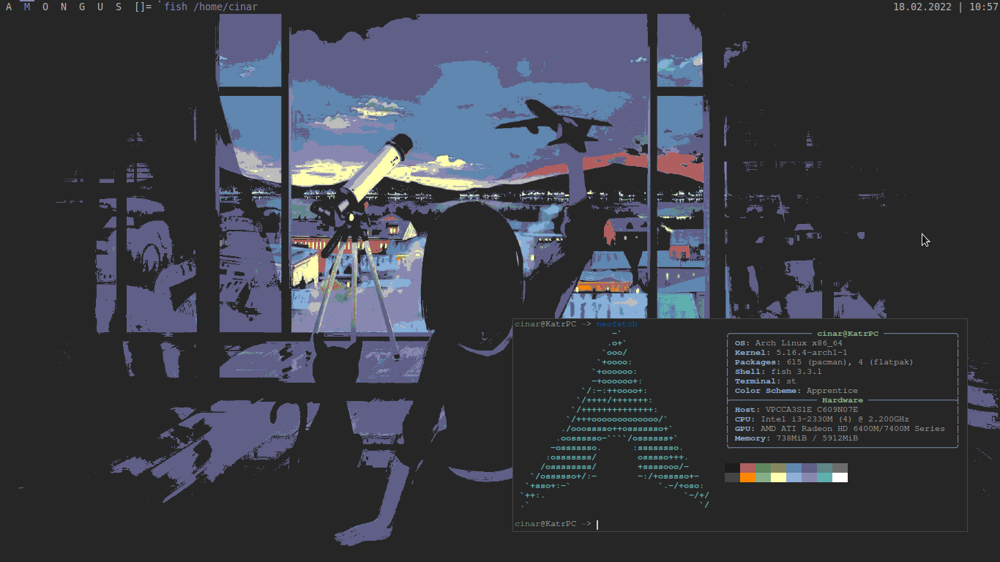
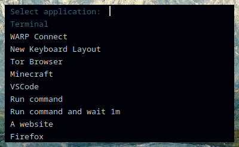
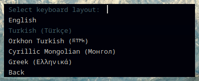
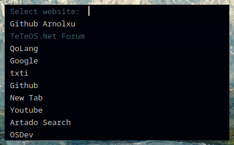

# dotfiles

## Application themes
Themes with a **\*** are my own themes.

* Firefox: [Ataturk](https://addons.mozilla.org/en-US/firefox/addon/ataturk-theme/)*
* Stylish themes:
  * [stopthemingmy.app Apprentice Theme](https://userstyles.org/styles/227478)*

## applaunch
Move `.applsh` to your home folder (e.g. `/home/cinar`), run ``sudo ln -s `pwd`/applaunch.sh /usr/local/bin/applaunch`` in the repo's folder. (if you don't use `sudo`, just replace it)

To install the ILU keyboard layout (QWILOVEU), copy the `ilu_keymap` file to `/usr/share/X11/xkb/symbols/ilu` and you'll be able to use it from applaunch.

## Screenshot

### Applaunch

